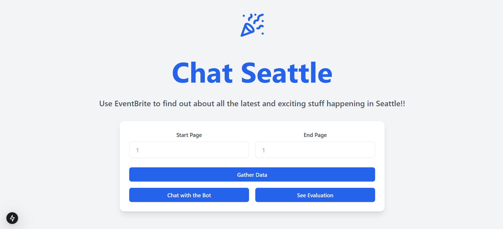

# Chat Seattle

This is a solution to the assignment of Zeal AI for Engineering Internship. The user can scrape the 
URL: https://www.eventbrite.com/d/wa--seattle/all-events/ and get the information about everything happening in Seattle.

## Getting Started
- Clone the repository using the command:
```
git clone https://github.com/helios2003/Zeal-AI-Assignment.git
```
- Change directory to `Zeal-AI-Assignment`.

### Using Docker
- Ensure that you have Docker in your system.
- Run the command and wait for all the containers to start
- Fill the `environment` variable in the `docker-compose.yml` file with the Pinecone API key. Check how to obtain one from [here](https://app.pinecone.io/organizations/-/keys).

```
docker-compose up -d
```
- The frontend runs on port 3000 and backend runs on port 8000.

### Locally on your system
#### Backend
- Rename `.env.example` to `.env` and fill it.
- Change directory to `backend/` folder.
- Create a virtual environment and activate it.
- Run `pip install -r requirements.txt` to install the dependencies.
- Run `python main.py` to bring up the backend.
#### Frontend
- Change directory to `frontend/` folder.
- Run `npm install` to install the dependencies
- Run `npm run dev` to bring up the frontend

## Screenshots
### Home Page Screenshot

### Modal Screenshot (for Settings)

### Chat Screenshot (for chatbot)

### Evaluation Screenshot (to verify RAG performance)


## Routes
- Go to `http://localhost:3000` and enter the range of page numbers to be scraped.
- You will get redirected to `/chat` route after scraping is complete. Here you can ask queries about
the scraped data.
- Go to `/evaluation` route to view a set of predefined questions and answers which serves as a benchmark of how well the RAG is performing.

## Features
- Good and smooth UX using loading screens
- Responsive UI
- Customization available by allowing user to choose page numbers range value, top_k value etc
- Chatbot like interface

## Potential Improvements
- Use a better and more powerful model like that of OpenAI or Claude
- Store the scraped data in a NoSQL DB like MongoDB.
- Add more custom metrics for RAG evaluation
- Use HTTP streaming to improve the UX

## Tech Stack
- FastAPI (for backend)
- BeautifulSoup (for scraping)
- [multilingual e5 large model](https://docs.pinecone.io/models/multilingual-e5-large) (for embeddings)
- Pinecone (for vector database)
- NextJS 15 (for frontend)
- ShadCN (for skeleton UI components)
